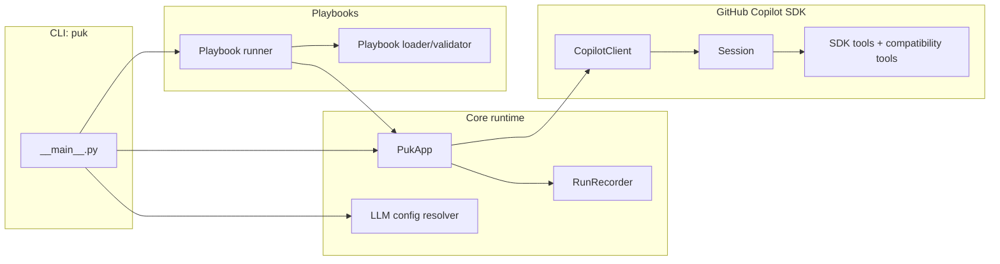

# 20. Architecture

Generated: 2026-02-09

## Component breakdown

| Component | Responsibility | Key files |
| --- | --- | --- |
| CLI entrypoint | Dispatch between REPL mode, `run` (playbooks), and `runs` (inspection) | `src/puk/__main__.py` |
| Core app / session | Create Copilot SDK session, stream output, enforce permissions, run REPL | `src/puk/app.py`, `src/puk/ui.py` |
| LLM config | Resolve provider/model/temperature/max tokens from defaults + global + workspace + CLI flags | `src/puk/config.py` |
| Playbooks | Load YAML front-matter, validate params, enforce write scope matching | `src/puk/playbooks.py` |
| Playbook runner | Create output directory; turn a playbook into a structured prompt; run in plan/apply | `src/puk/playbook_runner.py` |
| Run recording | Persist runs to `.puk/runs/**` (manifest + events + artifacts); lock to prevent concurrency | `src/puk/run.py` |
| Run inspection | List/show/tail runs and events | `src/puk/runs.py` |

## Runtime view

### REPL / one-shot mode

1. CLI (`__main__.py`) resolves LLM config and constructs `PukConfig`.
2. `PukApp.start()` starts Copilot client and creates a session with:
   - system message
   - tool allowlist (if configured)
   - permission handler for write-scope enforcement
3. `PukApp.repl()` (REPL) loops: user input → `ask()` → streamed model output.
4. If enabled, `RunRecorder` records events for inputs, tool calls, outputs.

Evidence pointers:
- `src/puk/__main__.py` (argument parsing + dispatch)
- `src/puk/app.py` (`session_config`, `start`, `ask`, `repl`)
- `src/puk/run.py` (event log schema)

### Playbook execution

1. `load_playbook()` parses YAML front-matter and body.
2. Parameters are parsed (`key=value` strings), validated, and converted (including `path` resolution within workspace).
3. A prompt is constructed that embeds parameters and the playbook instructions.
4. Puk runs the prompt with tool allowlisting + write-scope enforcement.

Evidence pointers:
- `src/puk/playbooks.py` (`load_playbook`, `resolve_parameters`, `_convert_param_value`)
- `src/puk/playbook_runner.py` (`_build_prompt`, `_prepare_output_directory`)

## Safety boundaries

- **Workspace boundary**: tool paths are resolved relative to workspace and denied if escaping.
  - Evidence: `src/puk/app.py:_resolve_workspace_path()`
- **Write scope boundary**: deny any write/edit/create outside playbook `write_scope`.
  - Evidence: `src/puk/app.py:_permission_handler()` + `src/puk/playbooks.py:is_path_within_scope()`
- **Plan mode**: tool execution is denied.
  - Evidence: `src/puk/app.py:_permission_handler()`

## Diagrams

## Notes on vendored code

`vendor/copilot-sdk/**` appears to be a vendored upstream package/docs/tests. Treat it as a dependency/reference, not as the core application code.

Evidence pointers:
- `vendor/copilot-sdk/**`
