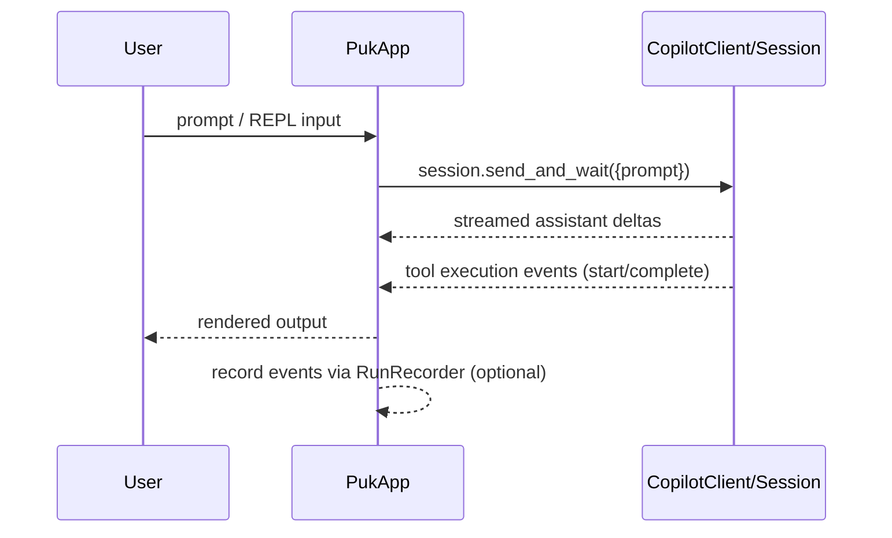

# 30. Backend API

Generated: 2026-02-09

## Summary

This repository does **not** appear to implement a networked backend API (no HTTP server, routing, or OpenAPI spec found in the `src/puk/**` application code).

Puk does interact with an external LLM backend via the **Copilot SDK**, but that interaction is through the SDK client/session abstraction (not a server exposed by this repo).

Evidence pointers:
- `src/puk/app.py` (uses `CopilotClient`, creates sessions, streams events)
- No `openapi.*` / `swagger.*` files detected under the app’s source paths

## External API dependencies (consumed)

| Dependency | Used for | Evidence |
| --- | --- | --- |
| `copilot` / GitHub Copilot SDK | Create LLM sessions, tool execution, streamed deltas | `src/puk/app.py` imports `CopilotClient`, `define_tool`, `SessionEventType` |

## Representative request flow (LLM interaction)

## Notes

If you expected a web API, search for additional packages outside `src/puk/` (e.g., other top-level `src/*`), but none were detected in this repo snapshot.
