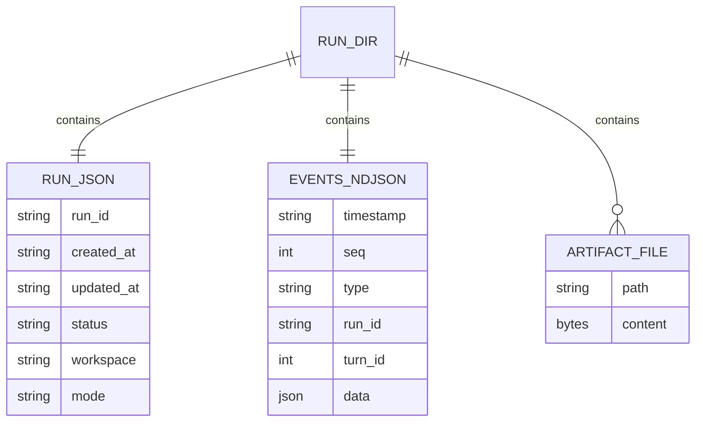

# 40. Data Model

Generated: 2026-02-09

## Summary

No database schema, ORM models, or migration system was detected in the core application code.

Puk persists run history to the **filesystem** under `.puk/runs/**` using:
- a JSON manifest file (`run.json`)
- an append-only NDJSON event log (`events.ndjson`)
- an artifacts directory (`artifacts/`)

Evidence pointers:
- `src/puk/run.py` (`RunPaths`, `RunRecorder`, manifest/event log writes)
- `src/puk/runs.py` (discovery + reading manifests/events)

## Persisted file formats (conceptual schema)

### Run directory layout

```
.puk/runs/<run_dir>/
  run.json
  events.ndjson
  artifacts/
  run.lock
```

Evidence pointers:
- `src/puk/run.py` (`RunPaths` fields; `RunRecorder.start()`)

### `run.json` (manifest) fields (best-effort)

From `RunRecorder.start()`:
- `run_id`
- `created_at`, `updated_at`
- `title`
- `status`
- `workspace`
- `mode`
- `llm`: provider/model/temperature/max_output_tokens

Evidence pointers:
- `src/puk/run.py` (manifest dict in `RunRecorder.start()`)

### `events.ndjson` (event record) fields (best-effort)

From `_append_event()`:
- `timestamp`
- `seq`
- `type`
- `run_id`
- `turn_id`
- `data` (event-specific payload)

Evidence pointers:
- `src/puk/run.py:_append_event()`

## ER-ish diagram (filesystem persistence)



## Notes / limitations

- This section is derived purely from static code reading; it does not inspect runtime-created `.puk/` contents.
- If future versions add additional persisted indices or caches, they should be documented alongside `run.json` and `events.ndjson`.
