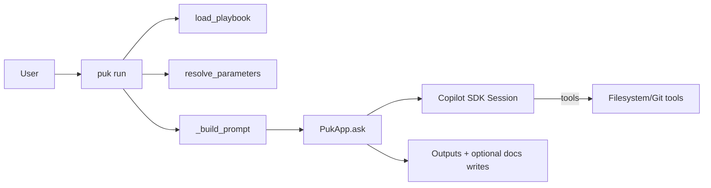

# 60. Inferred User Flows

Generated: 2026-02-09

## Evidence base

- Primary: `docs/15_functional_sources.md` (derived mainly from `README.md` and specs)
- Code references: `src/puk/__main__.py`, `src/puk/app.py`, `src/puk/playbook_runner.py`, `src/puk/playbooks.py`, `src/puk/run.py`, `src/puk/runs.py`

Because no explicit `functional_sources` were provided, any flow details beyond README/specs are marked as **inferred**.

## Flow 1: Start interactive REPL and chat

**Preconditions**
- Puk installed (per README, `uv sync`).

**Steps**
1. User runs `puk`.
2. App starts Copilot session.
3. User types a message; presses Ctrl+J to submit.
4. Assistant response is streamed to the terminal.

**Evidence pointers**
- README: REPL instructions
- `src/puk/app.py` (`PukApp.start`, `PukApp.repl`, `PukApp.ask`)
- `src/puk/ui.py` (`ConsoleRenderer`)

## Flow 2: Run a playbook (plan/apply)

**Preconditions**
- A playbook markdown file exists (e.g. `playbooks/reverse-engineer-docs.md`).

**Steps**
1. User runs `puk run playbooks/reverse-engineer-docs.md`.
2. CLI resolves LLM config and loads playbook.
3. Parameters are parsed/validated and converted.
4. A structured prompt is built embedding: parameters + allowed tools + write scope + playbook body.
5. Playbook executes in `plan` or `apply` mode.

**Evidence pointers**
- `src/puk/__main__.py` (dispatch to `run`)
- `src/puk/playbooks.py` (`load_playbook`, `parse_param_assignments`, `resolve_parameters`)
- `src/puk/playbook_runner.py` (`_build_prompt`, `_prepare_output_directory`)

## Flow 3: Inspect past runs

**Steps (CLI)**
1. `puk runs list` to see available runs.
2. `puk runs show <run_id|dir>` to view manifest + tail events.
3. `puk runs tail <run_id|dir>` to stream events.

**Steps (REPL local commands)**
- `/runs`, `/run <ref>`, `/tail <ref>`.

**Evidence pointers**
- `src/puk/__main__.py` (`runs` subcommand)
- `src/puk/runs.py` (discover/list/show/tail)
- `src/puk/app.py` (REPL local commands)

## Mermaid flow diagram (playbook execution)

